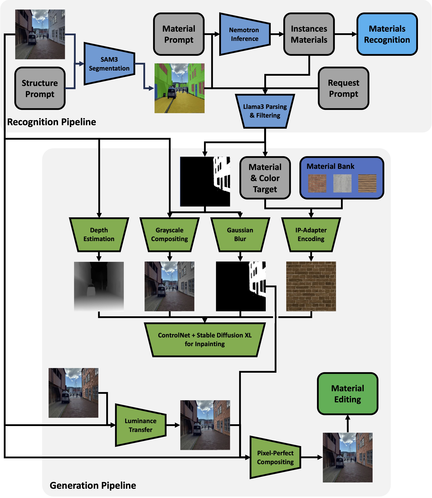

# FRESCO: Facade Recognition and Editing for Structure-aware City Outdoor imagery

**A Perception-First Framework for Urban Material Understanding and Editing**

**Article - Repainting the City: Geometry-Preserving Material Editing and Synthesis from Street Views**

> **Note:** This repository contains the official implementation of the **FRESCO** framework, developed for submission to the **European Conference on Computer Vision (ECCV)**.


*(Architecture diagram)*

## 📖 Overview

**FRESCO** addresses the challenge of structure-conditioned material recognition and editing in complex urban environments. Unlike standard text-to-image editing pipelines that treat images as flat grids of pixels, FRESCO adopts a **perception-first** approach. It explicitly decomposes urban scenes into semantic structural supports (walls, roofs, doors, windows, roads) before applying any generative transformations.

### Key Capabilities
* **Geometry-Aware Decomposition:** Utilizes **SAM3** to isolate fine-grained architectural instances (walls, roofs, doors, windows, roads) from background clutter.
* **Structured Material Recognition:** Uses **Nemotron-4** to extract stable material descriptors (class, color, state), avoiding dominant-material collapse common in global inference.
* **Geometry-Preserving Material Editing:** A powerful downstream application that enables high-fidelity material swapping (e.g., "concrete" → "brick") while strictly preserving the original 3D structure, window layouts and perspective.
* **Plausible Material Retrieval:** Features a guardrail system to ensure only architecturally realistic materials (e.g., prohibiting "green asphalt") are used.
* **Luminance-Aware Editing:** A custom post-processing pipeline that transfers original macro-lighting (shadows/AO) to generated textures, bypassing VAE degradation.

---

## 🛠️ Installation

This codebase is built upon the **IP-Adapter** architecture for Stable Diffusion XL. Please follow these steps strictly to set up the environment and download the necessary weights.

### 1. Core IP-Adapter Setup
First, clone the IP-Adapter repository and reorganize the directory structure:

```bash
# Clone the repository
git clone https://github.com/tencent-ailab/IP-Adapter.git

# Move the inner package to the root and clean up
mv IP-Adapter/ip_adapter ip_adapter
rm -rf IP-Adapter/
```

### 2. Model Weights Download
Download the pre-trained IP-Adapter models for SDXL. **Note:** You must have Git LFS installed.

```bash
# Install Git LFS
git lfs install

# Clone the model weights from HuggingFace
git clone https://huggingface.co/h94/IP-Adapter

# Organize models into the correct directory structure
mv IP-Adapter/models models
mv IP-Adapter/sdxl_models sdxl_models
rm -rf IP-Adapter/
```

### 3. Dependencies
Install the required Python packages for configuration management and environment variables:

```bash
pip install pyyaml python-dotenv
# Ensure you have other standard deps like torch, diffusers, transformers, etc.
```

### 4. API Key Configuration
FRESCO uses NVIDIA's API for the Nemotron VLM and Llama-3.1 parsing.
1. Create a file named `.env` in the root directory.
2. Add your API key:

```env
NVIDIA_API_KEY=nvapi-xxxxxxxxxxxxxxxxxxxxxxxx
```

---

## ⚙️ Configuration

FRESCO is designed for reproducibility. It is controlled by a **single configuration file**:

* **Path:** `pipeline.yaml`

This file manages all parameters, including SAM3 thresholds, Nemotron prompts, and file paths. This ensures that experiments are reproducible for colleagues and reviewers, regardless of whether you run the code via a Jupyter Notebook or the Command Line Interface (CLI).

---

## 🚀 Usage
You can use the notebook `run_pipeline.ipynb` to execute step-by-step the whole FRESCO workflow. In alternative, you can launch utility scripts singularly to execute specific tasks.

### Natural Language Editing (Single Image)
To perform a single, language-driven edit on a specific image (e.g., *"Change the wall of the biggest building to red brick"*), run the evaluator script. This script includes the **architectural plausibility guardrails**.

```bash
python generation_test.py --prompt "Change the wall of the biggest building on the right to white concrete" --json "ground_truth_eval.json"
```

**What happens:**
1. The system parses your prompt using Llama-3.1.
2. It retrieves a physically plausible texture from the `colored_material_bank`.
3. It generates the edit using SDXL + ControlNet + IP-Adapter.
4. It applies Luminance Transfer and Pixel-Perfect Compositing.

**Output:** Check `nlp_results/` for the final image and `nlp_results/debug_vis/` for intermediate steps (masks, depth maps, lighting transfer).

### Benchmark Generation
To generate the full quantitative benchmark (N=50 pairs) used in the paper:

```bash
python generate_benchmark_set.py
```
This script automatically samples random *plausible* material swaps for walls, roofs, and roads, saving the dataset to `benchmark_dataset.json`.

### Quantitative Generation Evaluation
To reproduce the SSIM, CLIP, and FID metrics reported in the paper:

```bash
python evaluate_generation.py
```
This produces the `generation_evaluation_report.json` containing the ablation study results (Original vs. Global vs. Proposed vs. Improved).

---

## 📂 Output Structure
* **`sam3_instances/`**: Contains the segmentation instances extracted with SAM3.
* **`masked_rgb/`**: Contains the segmentation instances categorized with materials with Nemotron.
* **`nlp_results/`**: Contains the final edited images.
* **`nlp_results/debug_vis/`**: Contains visual debugging steps:
    * `03_binary_mask.jpg`: The raw SAM3 mask.
    * `05_depth_map.jpg`: The DPT-Hybrid depth estimation.
    * `06_grayscale_initialization.jpg`: The composite used to guide SDXL.
    * `08_lighting_matched.jpg`: The generated texture after Luminance Transfer.
    * `09_final_output.jpg`: The final result after compositing.
* **`benchmark_results/`**: Contains ablation study images from benchmark set.
---